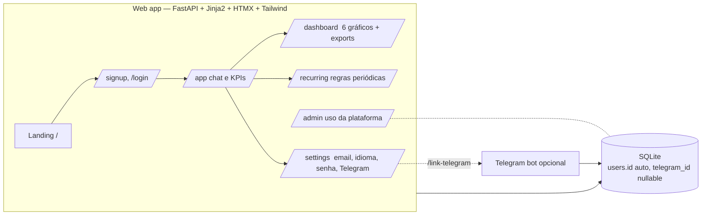

# Finance — Web app + Telegram bot

App web mobile-first para registrar e controlar gastos pessoais, com bot do Telegram opcional. Crie sua conta direto no site, registre gastos por linguagem natural ("jantar 30 usd"), acompanhe métricas e gráficos no dashboard, e — se quiser — vincule sua conta ao bot do Telegram para registrar pelo celular.

> **2.0 — web-first release**: o app passou a ter uma frente web própria (FastAPI + Jinja + HTMX + Tailwind) com landing pública, signup/login com e-mail obrigatório, chat in-site, dashboard completo, recurring, admin e mobile-first. O bot do Telegram virou opcional e usa o mesmo banco. Migração de schema é automática (coluna `telegram_id` desacoplada do `users.id`).



---

## Funcionalidades

### Web app
- **Landing pública** + signup com usuário, e-mail (obrigatório) e senha
- **Login por usuário OU e-mail** (case-insensitive), com sessão por cookie HttpOnly e proteção CSRF
- **Chat in-site** que entende linguagem natural (`"jantar 30 usd ontem"`, `"recebi 5000 salario"`) e categoriza automaticamente
- **Dashboard completo**: KPIs, 6 gráficos (timeline, donut por categoria, barras, acumulado, comparison, histórico mensal), tabela top expenses, log com busca, export CSV/PDF
- **Recorrentes**: criar/pausar/remover regras (aluguel, salário, assinaturas)
- **Admin panel**: KPIs da plataforma + gráficos de atividade
- **Multi-idioma**: pt-BR, en, ja
- **Multi-moeda** (BRL, USD, EUR, JPY, GBP) com conversão por cotação
- **Mobile-first**: bottom nav em telas pequenas, dark mode com fallback no `prefers-color-scheme`

### Bot do Telegram (opcional)
Mesmos comandos de antes (`/today`, `/week`, `/month`, `/summary`, `/delete`, `/edit`, `/recurring`, etc.) — agora atrelados ao mesmo banco do web app.

**O site é o único lugar de cadastro.** O bot virou um companion: se alguém mandar `/start` (ou qualquer mensagem) no Telegram sem ter conta, o bot responde com o link do site pra criar a conta primeiro. Depois é só ir em **Settings → Telegram** no site e usar o deep link `/start link_<código>` pra vincular o Telegram à conta web.

---

## Setup local

### 1. Clone e instale dependências

```bash
git clone <repo-url>
cd Finance_bot
python -m venv .venv
source .venv/bin/activate           # Linux / macOS
# .\.venv\Scripts\Activate.ps1     # Windows PowerShell

# Para rodar a web:
pip install -r web/requirements.txt
# Para rodar o bot do Telegram (opcional):
pip install -r requirements.txt
```

### 2. Configure `.env`

```bash
cp .env.example .env
# Edite com seus valores
```

Variáveis principais:

| Variável | Onde é usada | Obrigatório |
|----------|--------------|:-----------:|
| `TOKEN` | Bot do Telegram (token do @BotFather) | Só pro bot |
| `BOT_USERNAME` | Web — gera o deep link `t.me/<bot>?start=link_CODE` no Settings. Default: `Folhinha_bot` | Não |
| `WEB_PORT` | Porta do uvicorn (default 8000) | Não |
| `WEB_URL` | URL pública do web app, mostrada nas mensagens do bot (signup-redirect, /help). `DASHBOARD_URL` é aceito como alias depreciado. | Recomendado em produção |
| `ALLOWED_USERS` | Lista de Telegram IDs autorizados a usar o bot | Não |
| `BOT_OWNER` | Telegram ID do dono (ganha acesso ao `/admin`) | Não |
| `TIMEZONE` | Timezone padrão para novos usuários | Não |

### 3. Rode o web app

```bash
python -m uvicorn web.main:app --host 127.0.0.1 --port 8000 --reload
```

Abra http://localhost:8000 no navegador, crie sua conta, e pronto. O e-mail é obrigatório no primeiro acesso (qualquer conta sem e-mail é redirecionada para `/email-setup`).

### 4. (Opcional) Rode o bot do Telegram

Em outro terminal:

```bash
python -m bot.main
```

---

## Docker / docker-compose

```bash
docker compose up -d
```

Sobe dois serviços:
- **`web`** — FastAPI/uvicorn na porta `8000`
- **`bot`** — bot do Telegram (precisa do `TOKEN` no `.env`)

Ambos compartilham `./data/data.db` via volume.

Para subir só o web:

```bash
docker compose up -d web
```

---

## Cadastro e fluxo de e-mail

1. Usuário acessa `/` → clica **Sign up**
2. Preenche usuário + e-mail (opcional no form, mas obrigatório a partir do primeiro acesso à área logada) + senha
3. Logged-in: pode trocar e-mail / senha / idioma / moeda / timezone em **Settings**
4. Para vincular Telegram: **Settings → Link Telegram** → site gera código de 6 dígitos válido por 10 min → no bot envia `/start link_CODE`
5. Usuário pode logar com **usuário** ou **e-mail** (case-insensitive)

---

## Categorização automática

| Categoria | Exemplos de palavras-chave |
|-----------|---------------------------|
| Alimentação | mercado, supermercado, feira, padaria |
| Refeição | jantar, almoço, café, restaurante, pizza |
| Transporte | uber, gasolina, estacionamento, ônibus |
| Moradia | aluguel, condomínio, luz, água, internet |
| Saúde | farmácia, remédio, médico, consulta |
| Educação | curso, livro, escola, faculdade |
| Lazer | cinema, viagem, hotel, bar, netflix |
| Vestuário | roupa, sapato, camisa, calça |
| Salário/Renda | salário, freelance, dividendo, recebido |
| Outros | (padrão quando não há correspondência) |

NLP entende variações de moeda (`"30 dolares"`, `"5000 ienes"`), datas relativas (`"ontem"`, `"semana passada"`) e marca tipo (`income` vs `expense`) automaticamente.

---

## Banco de dados (SQLite)

Arquivo: `data/data.db` (criado e migrado automaticamente em `setup_database()`).

Principais tabelas:

- **`users`** — `id` (auto), `username`, `email`, `password_hash`, `telegram_id` (nullable, unique), `lang`, `is_admin`, `session_token`, `created_at`
- **`transactions`** — `user_id`, `description`, `amount`, `amount_original`, `currency_code`, `category`, `category_id`, `type` (expense/income), `source` (web/telegram), `status`, `created_at`
- **`user_preferences`** — `user_id`, `currency_default`, `timezone`, `confirmation_mode`
- **`recurring_transactions`**, **`recurring_logs`** — regras periódicas
- **`telegram_link_codes`** — códigos one-time usados em Settings → Link Telegram
- **`exchange_rates`** — cotações para conversão multi-moeda
- **`categories`**, **`category_aliases`** — taxonomia + sinônimos por idioma
- **`usage_events`**, **`app_events`** — telemetria interna

Migrações são aplicadas automaticamente: a coluna `telegram_id` foi adicionada para desacoplar o `users.id` do ID do Telegram (o backfill copia o `id` antigo para `telegram_id` e libera novos IDs auto-incrementados para signups web).

---

## Estrutura do projeto

```
Finance_bot/
├── bot/                       # Telegram bot
│   └── main.py
├── web/                       # FastAPI app (mobile-first)
│   ├── main.py
│   ├── auth.py                # session cookie + CSRF + email gate
│   ├── period.py              # date range helpers
│   ├── routes/
│   │   ├── landing.py
│   │   ├── auth.py            # /signup /login /logout /email-setup
│   │   ├── app_view.py        # /app (chat, KPI strip, lista recente)
│   │   ├── dashboard.py       # /dashboard (Plotly.js + exports)
│   │   ├── recurring.py
│   │   ├── admin.py
│   │   └── settings.py
│   ├── templates/             # Jinja2 (Tailwind via CDN, HTMX, Plotly.js)
│   ├── static/
│   ├── Dockerfile
│   └── requirements.txt
├── utils/
│   ├── auth.py                # lookup_telegram_user (look-up only; web is source of truth)
│   ├── db.py                  # SQLite + migrations + CRUD
│   ├── parser.py              # parse_smart (linguagem natural)
│   ├── categories.py          # infer_category_with_confidence
│   ├── i18n.py                # pt/en/ja
│   └── export.py              # CSV / PDF
├── tests/                     # 352 tests
├── data/                      # SQLite (volume)
├── docker-compose.yml
├── Dockerfile                 # bot
├── requirements.txt           # bot
└── README.md
```

---

## Desenvolvimento

```bash
# Dependências de dev (ruff, pytest, etc.)
pip install -r requirements-dev.txt

# Testes
pytest tests/ -v

# Lint
ruff check .
```

---

## CI/CD

GitHub Actions (`.github/workflows/ci.yml`):

1. **Lint + test** em cada push e PR
2. **Bump de versão + tag** ao mergear em `master`
3. **Deploy via SSH** para o servidor Oracle Cloud (`docker compose build` + `up`)

Backup automático de `data/data.db` antes de cada deploy.
